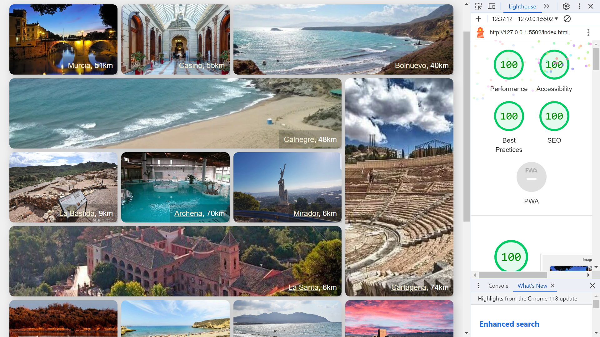

# :zap: HTML CSS Grid

* Single page optimised HTML-CSS website to display a grid of images and achieve a perfect lighthouse score
* **Note:** to open web links in a new window use: _ctrl+click on link_


## :page_facing_up: Table of contents

* [:zap: HTML CSS Grid](#zap-html-css-grid)
  * [:page\_facing\_up: Table of contents](#page_facing_up-table-of-contents)
  * [:books: General info](#books-general-info)
  * [:camera: Screenshots](#camera-screenshots)
  * [:signal\_strength: Technologies](#signal_strength-technologies)
  * [:floppy\_disk: Setup](#floppy_disk-setup)
  * [:computer: Code Examples](#computer-code-examples)
  * [:cool: Features](#cool-features)
  * [:clipboard: Status \& To-Do List](#clipboard-status--to-do-list)
  * [:clap: Inspiration](#clap-inspiration)
  * [:file\_folder: License](#file_folder-license)
  * [:envelope: Contact](#envelope-contact)

## :books: General info

* Built with HTML and CSS
* Perfect performance, Perfect scores on accessibility, best practices and SEO.
* CSS is minimised to reduce initial render/First Contentful Paint time.

## :camera: Screenshots

.

## :signal_strength: Technologies

* [HyperText Markup Language HTML](https://developer.mozilla.org/en-US/docs/Glossary/HTML)
* [Cascading Style Sheets CSS](https://developer.mozilla.org/en-US/docs/Web/CSS) styling
* [JPG to WebP Converter](https://www.freeconvert.com/jpg-to-webp) to create new image formats that result in a higher Lighthouse score
* [PurifyCSS Online](https://purifycss.online/) - remove unused CSS code from your stylesheets
* [Online CSS Minifier Tool and Compressor](https://www.toptal.com/developers/cssminifier)

## :floppy_disk: Setup

* Open index.html using [Visual Studio Live Server](https://marketplace.visualstudio.com/items?itemName=ritwickdey.LiveServer). Changes are updated automatically on server.

## :computer: Code Examples

* index.html extract showing how new format webp images are marked up in HTML

```html
        <!--image 1-->
        <div class="gallery__item">
            <picture>
                <source type="image/webp" width="640" height="432" srcset="img/webp/Murcia.webp" alt="Murcia"
                    class="gallery__img" loading="lazy" />
                <source type="image/jpeg" width="640" height="432" srcset="img/jpg/Murcia.jpg" alt="Murcia"
                    class="gallery__img" loading="lazy" />
                
            </picture>
            <p class="gallery__title"><a href="https://www.turismodemurcia.es" target="_blank"
                    rel="noopener noreferrer">Murcia</a>, 51km</p>
        </div>
```

## :cool: Features

* Lighthouse score perfect

## :clipboard: Status & To-Do List

* Status: Working.
* To-Do: Image sizes can be reduced to improve loading time

## :clap: Inspiration

* [W3 Schools: How TO - Responsive Image Grid](https://www.w3schools.com/howto/howto_css_image_grid_responsive.asp)

## :file_folder: License

* This project is licensed under the MIT License - see the LICENSE file for details.

## :envelope: Contact

* Repo created by [ABateman](https://github.com/AndrewJBateman), email: `gomezbateman@yahoo.com`
